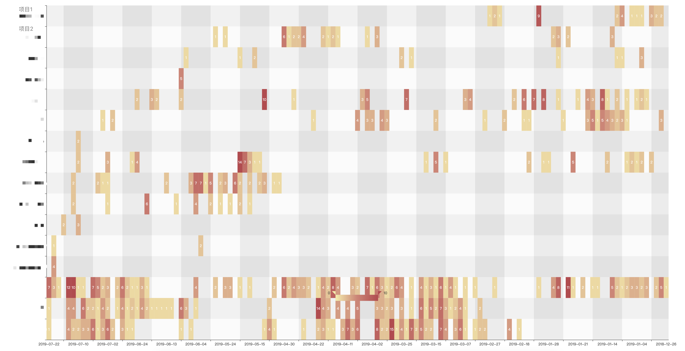

# git push 记录热力图，时不时看看自己都忙忙碌碌到底干了个啥

## example



## 操作步骤

```
pipenv install
pipenv run python gitlab.py ${userID} ${PRIVATE-TOKEN} ${gitUrl}
```

- ${userID} 可以在开发者工具 Elements 里面查看 gon.current_user_id 的值

- ${PRIVATE-TOKEN} 参考 [Creating a personal access token](https://docs.github.com/cn/authentication/keeping-your-account-and-data-secure/creating-a-personal-access-token)

```
npm install
npm run build
```

打开 `dist/heatmap-cartesian.html`
